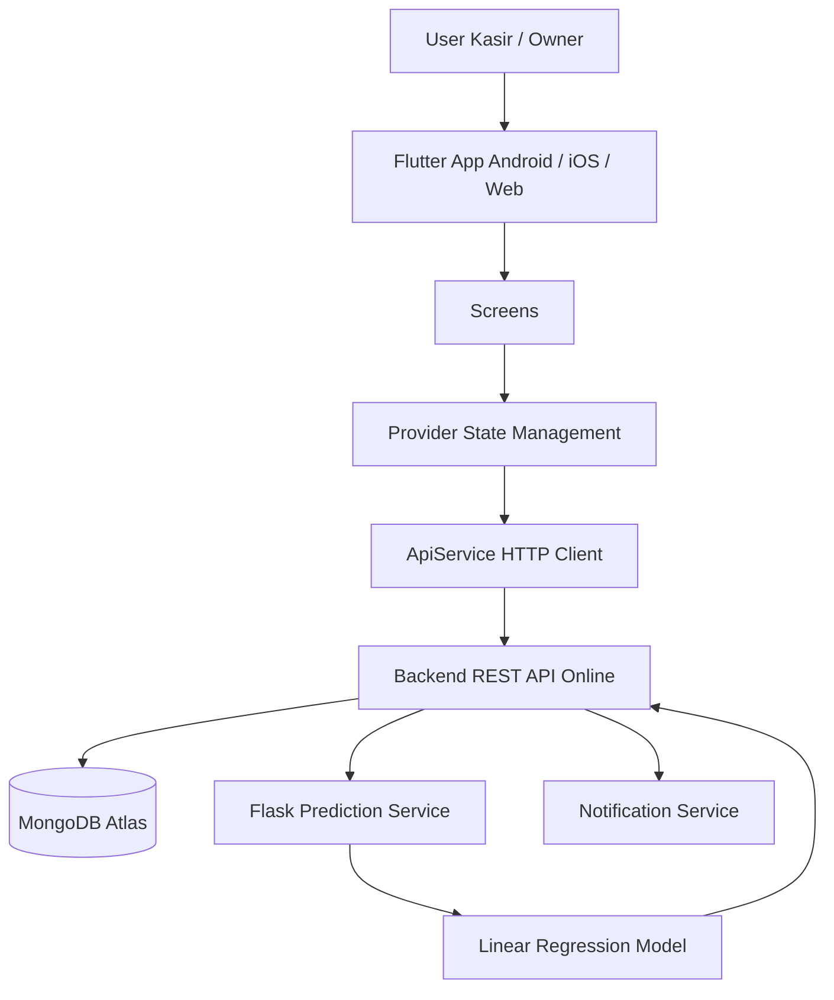

# 🌸 Flower Shop App - Flutter Mobile

Sistem mobile untuk operasional toko bunga. Mendukung dua role: **Kasir** dan **Owner**.

---

## Overall Architecture

Arsitektur aplikasi menggunakan Flutter sebagai client multi-platform untuk Android, iOS, dan Web. Aplikasi berkomunikasi dengan backend REST API online untuk autentikasi, stok bunga, transaksi, dashboard, prediksi permintaan, dan notifikasi. Data utama tersimpan di **MongoDB Atlas**, sedangkan proses prediksi penjualan dijalankan oleh **model Linear Regression berbasis Flask yang sudah online**.



Layer utama:
- **Screens** menangani tampilan dan interaksi pengguna.
- **Providers** mengelola state aplikasi seperti auth, stok, transaksi, prediksi, dan notifikasi.
- **ApiService** menjadi penghubung antara aplikasi Flutter dan backend REST API online.
- **Backend REST API** memproses request aplikasi, membaca/menulis data ke MongoDB Atlas, dan menyediakan endpoint untuk mobile.
- **MongoDB Atlas** menyimpan data user, stok bunga, transaksi, dan hasil prediksi.
- **Flask Prediction Service** menjalankan model Linear Regression secara online dan mengembalikan hasil prediksi ke backend.

---

## 📁 Struktur Project

```
lib/
├── main.dart                    # Entry point
├── theme/
│   └── app_theme.dart           # Warna & tema global
├── models/
│   ├── user.dart                # Model user + role
│   ├── flower_stock.dart        # Model stok bunga
│   └── transaction.dart        # Model transaksi + item
├── services/
│   └── api_service.dart         # HTTP client ke backend REST API
├── providers/
│   ├── auth_provider.dart       # State login/logout
│   ├── stock_provider.dart      # State manajemen stok
│   ├── transaction_provider.dart # State keranjang & transaksi
│   ├── prediction_provider.dart # State prediksi permintaan
│   └── notification_provider.dart # State notifikasi
└── screens/
    ├── splash_screen.dart       # Loading + cek auth
    ├── login_screen.dart        # Form login
    ├── main_navigation.dart     # Bottom nav (role-based)
    ├── home_screen.dart         # Dashboard beranda
    ├── stock_screen.dart        # List & filter stok bunga
    ├── transaction_screen.dart  # Kasir + riwayat transaksi
    ├── prediction_screen.dart   # Prediksi permintaan (owner only)
    └── notification_screen.dart # Notifikasi stok & sistem
```

---

## 🚀 Setup & Instalasi

### 1. Prerequisites
- Flutter SDK >= 3.0.0
- Dart >= 3.0.0

### 2. Install dependencies
```bash
flutter pub get
```

### 3. Konfigurasi Backend URL
Secara default aplikasi memakai URL lokal:

```dart
http://127.0.0.1:8000/api
```

Untuk memakai backend online, jalankan aplikasi dengan `--dart-define`:

```bash
flutter run --dart-define=API_BASE_URL=https://domain-backend-kamu.com/api
```

### 4. Jalankan app
```bash
flutter run
```

---

## 🎨 Fitur per Screen

### 🏠 Home (Beranda)
- Greeting berdasarkan waktu
- Badge role (Kasir / Owner)
- Statistik hari ini: transaksi, pendapatan, total stok, stok kritis
- Alert warning jika ada stok hampir habis
- Preview 3 item stok kritis

### 📦 Stock (Stok Bunga)
- List semua stok bunga real-time
- Search by nama bunga
- Filter by kategori
- Filter "Stok Kritis" only
- Status badge: Normal / Kritis / Habis
- Warna card berubah sesuai status

### 🛒 Kasir (Transaksi)
- Tab "Transaksi Baru" - grid produk
- Tombol + / - quantity per item
- Cart summary bar di bawah (sticky)
- Checkout sheet:
  - Daftar item & subtotal
  - Pilih metode pembayaran (Tunai/QRIS/Transfer/Debit)
  - Input jumlah dibayar (untuk tunai)
  - Kalkulasi kembalian otomatis
  - Proses pembayaran
- Tab "Riwayat" - list transaksi

### 📊 Prediksi (Owner Only)
- Pilihan periode: 7 hari / 30 hari / 3 bulan
- Card per bunga dengan:
  - Nama bunga
  - Jumlah prediksi permintaan
  - Persentase akurasi + progress bar berwarna
  - Rekomendasi teks dari ML

### 🔔 Notifikasi
- List notifikasi dengan tipe:
  - 🟡 Stok hampir habis
  - 🔴 Stok habis
  - 🟢 Transaksi berhasil
  - 🔵 Info sistem
- Unread badge di bottom nav
- Tap untuk mark as read
- Menu logout

---

## 🔌 API Endpoints yang Digunakan

| Method | Endpoint | Keterangan |
|--------|----------|------------|
| POST | /auth/login | Login user |
| POST | /auth/logout | Logout |
| GET | /stocks | List stok bunga |
| PATCH | /stocks/:id/adjust | Update stok manual |
| GET | /transactions | List transaksi |
| POST | /transactions | Buat transaksi baru |
| GET | /dashboard/summary | Ringkasan dashboard |
| GET | /predictions | Data prediksi ML |
| GET | /notifications | List notifikasi |
| PATCH | /notifications/:id/read | Tandai dibaca |

---

## 👥 Role-Based Access

| Fitur | Kasir | Owner |
|-------|-------|-------|
| Beranda | ✅ | ✅ |
| Stok Bunga | ✅ (lihat) | ✅ (lihat + edit) |
| Input Transaksi | ✅ | ✅ |
| Riwayat Transaksi | ✅ | ✅ |
| Prediksi Permintaan | ❌ | ✅ |
| Notifikasi | ✅ | ✅ |

---

## 🛠 Dependencies Utama

- `provider` - State management
- `http` - HTTP requests ke API
- `flutter_secure_storage` - Simpan token aman
- `intl` - Format mata uang Rupiah
- `fl_chart` - Grafik (optional, untuk chart prediksi)
- `flutter_local_notifications` - Push notification lokal

---

## 📝 TODO / Next Steps

- [ ] Tambah font Poppins ke assets/fonts/
- [ ] Implementasi FCM push notification
- [ ] Tambah halaman detail transaksi + struk cetak
- [ ] Tambah halaman grafik penjualan (owner)
- [ ] Implementasi refresh token otomatis
- [ ] Tambah fitur input/update stok manual oleh admin
- [ ] Unit test untuk providers

---

## Lisensi

Proyek ini menggunakan **MIT License**. Detail lisensi tersedia pada file [LICENSE](LICENSE).
